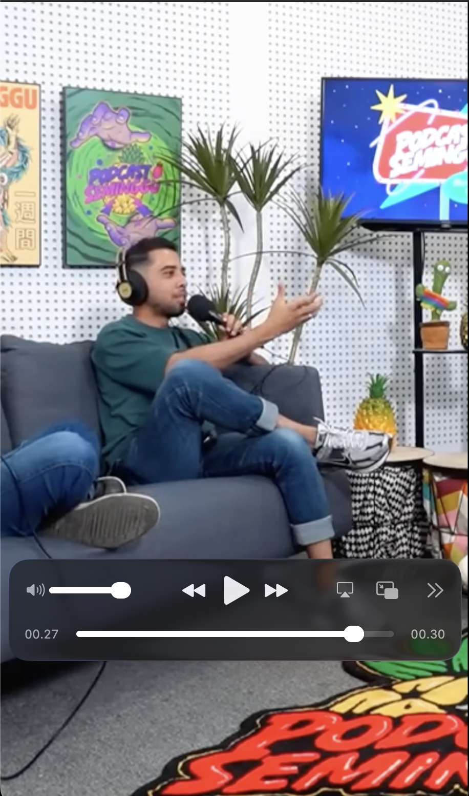
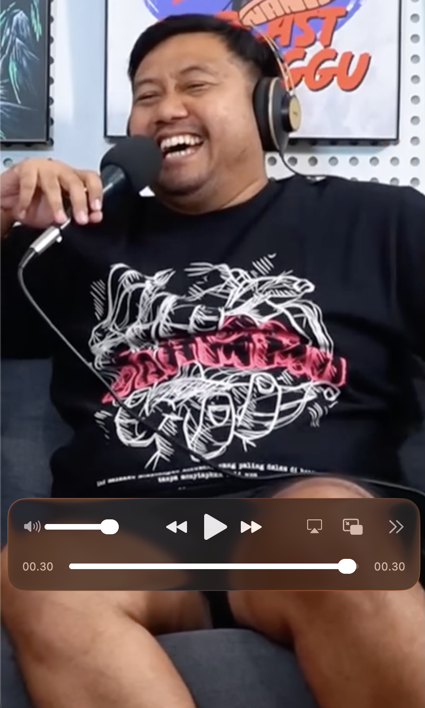

# AI YouTube Short Video Generator


Automated pipeline extracts most engaging moments from long-form YouTube videos, then renders vertical short clips (9:16) with smart face-tracking crop.

---

## Preview

 

Generated clips in `output/`.

---

## Features

- **Automatic highlight detection** — LLM ranks moments by virality: hooks, emotional peaks, hot takes, quotables, conflict, practical value
- **Configurable aspect ratio** — 9:16 vertical, 1:1 square, or any custom `W:H`
- **Smart face-tracking crop** — YuNet DNN detects speaker face, crops 9:16 window to keep subject centered (falls back to center-crop if no face)
- **Local transcription** — faster-whisper, no API cost, VAD filtering, auto CUDA detection
- **Multi-provider LLM** — OpenAI, Gemini
- **Result caching** — skips completed transcription/analysis on re-run, `--force` to override
- **CLI + REST API + Web UI** — three interfaces to run the pipeline

---

## Architecture

```
                          ┌─────────────────────────────────────────────────────┐
                          │                    PIPELINE                      │
                          │                                                     │
 YouTube URL ──► 1. Download ──► 2. Transcribe ──► 3. Analyze ──► 4. Render ──► Short clips
   / file         yt-dlp          faster-whisper    LLM (×2)        ffmpeg        .mp4
                                        │               │               │
                                        ▼               ▼               ▼
                                  timestamped      highlights      face-aware
                                   segments       {start,end,      crop 9:16
                                                   score,title}
                          ── cache (JSON) ──────────────┘
```

Stages run sequentially. Only rendering always re-runs; transcription and analysis reuse cache from `output/.cache_<video>/`.

---

## Tech Stack

| Component          | Tool                           |
| ------------------ | ------------------------------ |
| Video download     | yt-dlp                         |
| Transcription      | faster-whisper (local, no API) |
| Highlight analysis | OpenAI / Gemini                |
| Face detection     | OpenCV YuNet DNN               |
| Video rendering    | ffmpeg                         |
| API server         | FastAPI + uvicorn              |
| Frontend           | Vanilla HTML/JS                |

---

## Prerequisites

- Python >= 3.10
- ffmpeg (system binary, not Python wrapper)

```bash
# check if installed
ffmpeg -version

# install if missing
brew install ffmpeg      # macOS
sudo apt install ffmpeg  # Debian/Ubuntu
```

---

## Installation

```bash
git clone https://github.com/IwonGunawan/ai-youtube-short-video.git
cd ai-youtube-short-video
python3 -m venv venv && source venv/bin/activate
pip install -r requirements.txt
```

Download the YuNet face detection model:

```bash
mkdir -p models
curl -L -o models/face_detection_yunet_2023mar.onnx \
  "https://github.com/opencv/opencv_zoo/raw/main/models/face_detection_yunet/face_detection_yunet_2023mar.onnx"
```

## Configuration

Copy `.env.example` to `.env`, fill API credentials:

```env
LLM_PROVIDER=gemini           # openai | gemini

GEMINI_API_KEY=your_key
GEMINI_MODEL=gemini-3.6-flash

OPENAI_API_KEY=your_key
OPENAI_MODEL=gpt-4o-mini

LOCAL_WHISPER_MODEL=base      # tiny | base | small | medium | large-v3
LOCAL_WHISPER_DEVICE=auto     # auto | cpu | cuda
```

Only selected provider needs valid key.

---

## How to Use

### CLI

```bash
python main.py <youtube_url_or_file> [options]
```

| Option         | Default | Values                            |
| -------------- | ------- | --------------------------------- |
| `--n`          | 3       | Any integer                       |
| `--ratio`      | 9:16    | Any W:H ratio                     |
| `--resolution` | 720     | 360, 480, 720, 1080               |
| `--language`   | auto    | ISO 639-1 code (en, zh, id, etc.) |
| `--no-hook`    | off     | Flag                              |
| `--force`      | off     | Flag, ignore cache                |

```bash
# Basic — 3 clips, vertical
python main.py "https://www.youtube.com/watch?v=dQw4w9WgXcQ"

# Custom — 5 clips, square, 1080p, force English, re-process all stages
python main.py "https://www.youtube.com/watch?v=dQw4w9WgXcQ" \
    --n 5 --ratio 1:1 --resolution 1080 --language en --force

# Local file
python main.py ./my_video.mp4 --n 2
```

Output goes to `./output/`.

### REST API

```bash
python server.py    # starts on http://127.0.0.1:5000
```

| Endpoint        | Method | Body                                                                                                          |
| --------------- | ------ | ------------------------------------------------------------------------------------------------------------- |
| `/api/health`   | GET    | -                                                                                                             |
| `/api/generate` | POST   | `{"target": "...", "n": 3, "ratio": "9:16", "resolution": 720, "language": "", "hook": true, "force": false}` |

```json
{
  "target": "https://...",
  "success": true,
  "output_files": ["clip_01_Highlight.mp4"],
  "log": "..."
}
```

### Web Interface

```bash
# start API (port 5000)
python server.py &

# serve frontend (port 8000)
cd web && python3 -m http.server 8000
```

Open http://localhost:8000/web.html

---

## Pipeline

1. **Download** (`src/downloader.py`) — yt-dlp, format `bestvideo[height<=RES]+bestaudio`, falls back to lower res. Skips if input is local file.
2. **Transcription** (`src/transcriber.py`) — faster-whisper local, VAD filter, timestamped segments. Cached.
3. **Analysis** (`src/analyzer.py`) — two LLM calls: content classification + highlight scoring. Deduplicates overlaps. Cached.
4. **Rendering** (`src/renderer.py`) — face-aware crop to target ratio, scale, H.264/AAC encode.

---

## How It Works

1. Pipeline downloads (or accepts) a source video.
2. faster-whisper transcribes audio locally into timestamped segments — zero API cost.
3. LLM classifies content type, then scores transcript moments by virality and returns `{start, end, score, reason, title}`, enforcing 20–40 s clip length and overlap dedup.
4. For 9:16 output, YuNet DNN samples frames in each clip, finds largest face, computes horizontal center.
5. ffmpeg crops to 9:16 with crop window centered on detected face (clamped to frame bounds), scales, pads, encodes.
6. Transcription/analysis results cached; re-run skips prior stages unless `--force`.

---

## Project Structure

```
.
├── main.py                  # CLI entry point
├── server.py                # FastAPI server + REST API
├── src/
│   ├── __init__.py
│   ├── downloader.py        # yt-dlp wrapper
│   ├── transcriber.py       # faster-whisper wrapper
│   ├── analyzer.py          # LLM highlight detection (OpenAI/Gemini/MuAPI)
│   ├── face_detect.py       # YuNet DNN face detection for smart crop
│   ├── renderer.py          # ffmpeg clip rendering
│   ├── cache.py             # transcription/analysis result cache
│   └── pipeline.py          # orchestrator
├── web/
│   └── web.html             # browser UI
├── static/                  # preview images
├── models/                  # onnx models (gitignored)
├── output/                  # generated clips + cache (gitignored)
├── .env                     # credentials (gitignored)
└── requirements.txt
```

---

## Roadmap

- [x] Core download → transcribe → analyze → render pipeline
- [x] Smart face-tracking crop for 9:16
- [x] Result caching with `--force` override
- [ ] Key-frame face tracking across full clip (not just sample frames)
- [ ] Multi-face tracking (choose or average faces)
- [ ] Auto subtitle/burn-in captions on clips
- [ ] Music/SFX background mixing
- [ ] Batch processing multiple videos via web UI
- [ ] Docker deployment

---

## License

MIT License. See [LICENSE](LICENSE).
